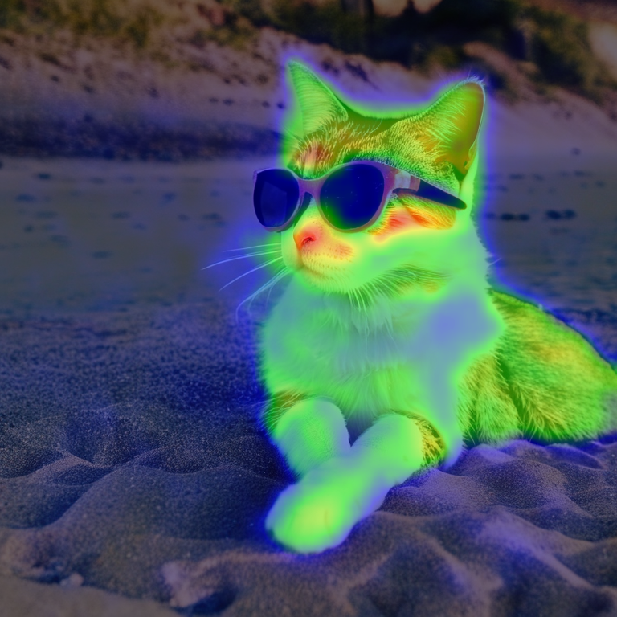
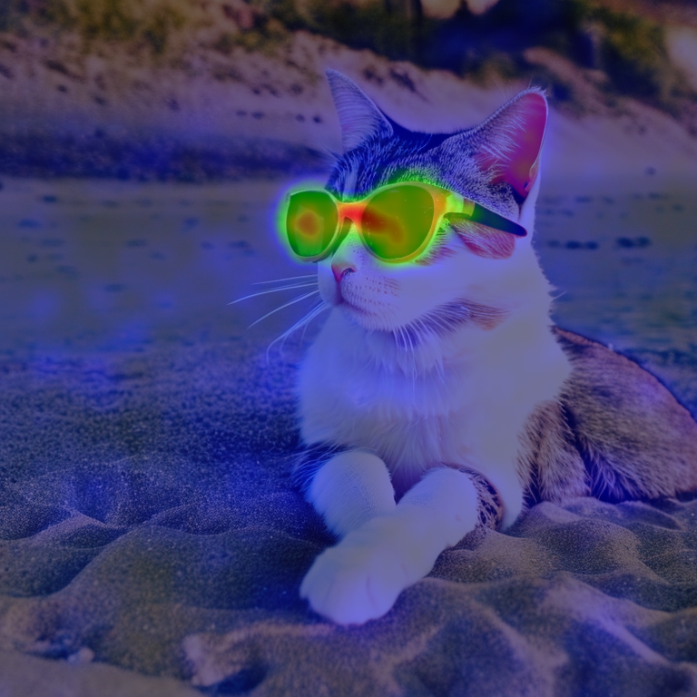
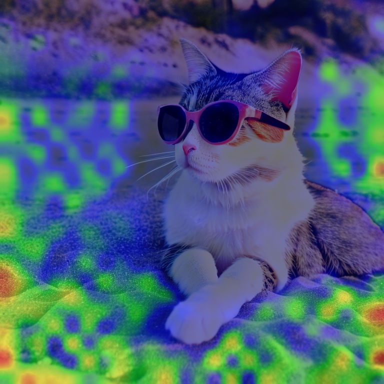

# DAAM 拡張機能(Stable Diffusion WebUI Forge Neo 対応版)

プロンプト中の各単語が、生成画像のどの部分に効いているかを **ヒートマップ** で
可視化する拡張機能です。[DAAM](https://github.com/castorini/daam)
(Diffusion Attentive Attribution Maps)を WebUI 用に移植したものです。

オリジナルは AUTOMATIC1111 WebUI 向けで 2024 年初頭に更新が止まっていました。
本フォークは **[Stable Diffusion WebUI Forge Neo](https://github.com/Haoming02/sd-webui-forge-classic)**
(ComfyUI 系に書き直された `backend`)で動くよう、内部を作り直した現代版です。

対応モデル: **SD 1.x** / **SDXL**

---

## インストール

このフォルダ一式を Forge Neo の `extensions` フォルダに置いて、UI を再起動してください。

```
<Forge Neo>/extensions/sd-webui-daam/
```

例(StabilityMatrix 経由でインストールしている場合):
`<StabilityMatrix のデータフォルダ>\Packages\<Forge Neo のパッケージ名>\extensions\sd-webui-daam\`

依存関係(matplotlib)は無ければ自動でインストールされます。

---

## 使い方

1. **設定 → 画像保存 →「生成した画像を常に保存する」を ON** にします。
   （画像が保存されるタイミングでヒートマップを生成する仕組みのため必須です）
2. txt2img / img2img 画面の **「Attention Heatmap」** アコーディオンを開きます。
3. **Attention texts** に、プロンプトに含まれる単語を入力します。
4. 通常どおり生成します。

生成すると、元画像に加えて、指定した単語ごとにヒートマップを重ねた画像が出力され、
通常の出力フォルダに `元ファイル名_単語.png` という名前で保存されます。

### Attention texts の書き方

- **カンマ区切り** で複数指定できます。例: `cat, sunglasses, beach`
- カンマで区切らず並べた語は **1 つの連続した語** として扱われます。
  - `cat` → プロンプト中の `cat` トークンすべてにマッチ
  - `cute cat` → `cute cat` という並びのトークンだけにマッチ
- プロンプトに含まれない単語を指定した場合、その単語はヒートマップなし
  (オーバーレイなしの元画像)として出力され、コンソールに警告が出ます。

### オプション

| オプション | 説明 |
|---|---|
| **Hide heatmap images** | ヒートマップ画像を UI ギャラリーに追加しない |
| **Do not save heatmap images** | ギャラリーには出すがファイル保存はしない |
| **Hide caption** | 画像に単語キャプションを描き込まない |
| **Use grid** | 複数のヒートマップを 1 枚のグリッドにまとめる(grids フォルダへ保存) |
| **Grid layout** | グリッドの並べ方(Auto / Prevent Empty Spot / Batch Length As Row) |
| **Heatmap blend alpha** | ヒートマップの重ね合わせ濃度(0〜1) |
| **Heatmap image scale** | 出力画像のスケール(0.1〜1.0) |
| **Trace each layers** | UNet の注意ブロックごと(`IN##` / `MID` / `OUT##`)に個別のヒートマップを出す |
| **Use layers as row** | レイヤー別ヒートマップをグリッドの行として並べる |

---

## 出力例

プロンプト: `A photo of a cute cat wearing sunglasses relaxing on a beach`

Attention texts: `cat, sunglasses, beach`

出力: 元画像 / cat / sunglasses / beach






---

## 仕組み(Forge Neo 移植の要点)

オリジナルは `ldm` の `CrossAttention.forward` を直接書き換えていましたが、Forge Neo
は `ldm`/`sgm` を使わず独自 `backend` を持ちます。本版では:

- 注意の取得を Forge **公式の ModelPatcher API**(`unet.set_model_attn2_replace`)
  経由で行います(内部の monkey-patch をしません)。
- 出力は本物の `backend.attention.attention_function` で計算するため、
  **生成画像は DAAM 無効時と同一** です。ヒートマップ用の softmax だけを別途取得します。
- トークナイズは Forge の `ClassicTextProcessingEngine` を利用します。
- 条件側(cond)の注意だけを `cond_or_uncond` で選び、空間サイズは `original_shape`
  から復元するため、バッチサイズや hires-fix にも追従します。
- UNet パッチャは毎回クローンに対して適用し、Forge が生成ごとにリセットするため
  手動のアンフックは不要です。

---

## 注意点・制限

- **対応は SD 1.x と SDXL のみ** です(クラシックな CLIP + U-Net 構造)。
  Flux・anima・SD3・Lumina など DiT 系モデルは DAAM の手法が適用できないため非対応で、
  これらのモデルで生成した場合はコンソールに `unsupported model` と表示して
  自動的にスキップします(生成自体は通常どおり行われます)。
- ヒートマップ取得のぶん、DAAM 有効時は生成がやや遅くなります。
- SD 1.5 で最も安定します。アーキテクチャによって精度は変わります。
- ヒートマップ生成には画像の自動保存が必要です(上記「使い方」1 を参照)。
- hires-fix で **元プロンプトと hires プロンプトのトークン数が異なる** 場合、
  hires パスのヒートマップは出ないことがあります(通常の同一プロンプト運用では問題ありません)。

---

## ライセンス

オリジナル DAAM / 本拡張のライセンスは [LICENSE](LICENSE) を参照してください。
